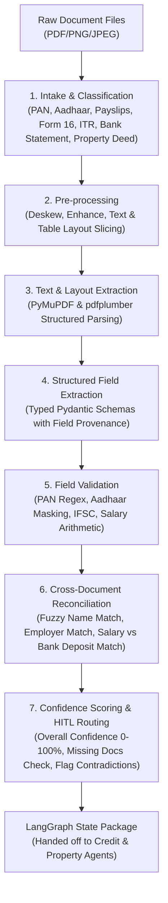

# Agentic AI Home Loan Underwriting System – India
## Agent 1: Document Ingestion Agent (Owner: Tejasva)

> **Purpose**: Converts raw borrower and property documents (PDF / Image) into clean, structured, and validated data — telling downstream agents **WHAT THE DOCUMENTS SAY** with complete field-level provenance, deterministic validation, cross-document reconciliation, and confidence scoring without judging creditworthiness.

---

## 🏗️ 7-Step Ingestion Pipeline Architecture



---

## 📦 What Has Been Built

1. **Structured Data Models & State (`src/models/`)**:
   - `PANCardData`: 10-char PAN validation, 4th character entity type ('P' = Individual), name, father name, DOB.
   - `AadhaarCardData`: 12-digit / masked (`XXXX-XXXX-1234`) validation, residential address, pin code, gender.
   - `SalarySlipData`: Itemized earnings (Basic, HRA, Allowances), itemized deductions (PF, PT, TDS), Gross/Net salary arithmetic verification (`Gross == Net + Deductions`).
   - `Form16Data`: Employer TAN & name, employee PAN, AY/FY chronological validation, Gross Salary u/s 17(1), Chapter VI-A deductions, taxable income, TDS.
   - `BankStatementData`: 6-month analysis, automated salary credit detection, recurring EMI debit identification, average monthly balance (AMB), closing balance, inward bounce counter.
   - `PropertyDocData`: Document type, property address, buyer & seller names, super built-up & carpet area (sq ft), consideration value, registration number.
   - `FieldProvenance`: Audit trail tracking the source document, page number, exact text snippet, and extraction confidence for every single field.

2. **Deterministic Domain Validators (`src/document_ingestion/validators.py`)**:
   - PAN format regex (`^[A-Z]{3}[PCHFATBLJG][A-Z]\d{4}[A-Z]$`).
   - Aadhaar format & masking verification.
   - Bank IFSC code format (`^[A-Z]{4}0[A-Z0-9]{6}$`).
   - Salary ledger arithmetic validation.
   - Assessment Year vs. Financial Year consistency checks.

3. **Cross-Document Reconciliation Engine (`src/document_ingestion/reconciliation.py`)**:
   - **Name Match Matrix**: Compares applicant name across KYC, salary slips, bank statements, and property deeds using token-based fuzzy matching.
   - **Employer Consistency**: Compares employer names between Salary Slips and Form 16.
   - **Income Deposit Reconciliation**: Verifies net salary on payslips against monthly credit transactions in bank statements within a tolerance band.
   - **Obligation Detection**: Extracts recurring EMI/loan debits to pass to Credit Agent.

4. **Confidence Scoring & HITL Routing (`src/document_ingestion/confidence.py`)**:
   - Computes weighted overall confidence ($0-100\%$) across OCR quality, validation pass rate, cross-reconciliation score, and mandatory document completeness.
   - Triggers Human-in-the-Loop review queue if confidence $< 85\%$, if mandatory documents are missing, or if critical contradictions are detected.

5. **LangGraph Shared State Node (`src/document_ingestion/agent.py`)**:
   - Exposes `document_ingestion_node(state)` ready to plug into the team's LangGraph multi-agent orchestrator.

6. **REST API for Frontend Integration (`src/api/app.py`)**:
   - `POST /api/v1/ingest/upload-and-process`: Upload document bundle & run pipeline.
   - `GET /api/v1/ingest/state/{application_id}`: Retrieve structured JSON state.
   - `POST /api/v1/ingest/demo/{scenario}`: Run built-in demo scenarios (`clean`, `name_mismatch`, `salary_mismatch`, `missing_docs`).
   - `POST /api/v1/ingest/hitl/override`: Human underwriter field override endpoint.

---

## 🚀 How to Run

### 1. Run Automated Test Suite (Pytest)
```bash
python -m pytest tests/ -v
```

### 2. Run CLI Scenarios
```bash
# Run prime clean scenario (Aarav Sharma - TCS)
python -m src.cli --demo clean

# Run name discrepancy scenario
python -m src.cli --demo name-mismatch

# Run income mismatch scenario
python -m src.cli --demo salary-mismatch

# Run missing documents scenario
python -m src.cli --demo missing-docs

# Ingest custom folder of PDFs
python -m src.cli --input ./path/to/pdf/folder/ --export-json result.json
```

### 3. Start FastAPI Server (For Frontend Teammate)
```bash
python -m uvicorn src.api.app:app --reload --port 8000
```
Interactive OpenAPI documentation will be available at: `http://127.0.0.1:8000/docs`.

---

## 🤝 Team Integration Contract

### How Downstream Agents Consume Document Ingestion State:

```python
from src.document_ingestion.agent import document_ingestion_node

# Input state provided to LangGraph
state = {
    "application_id": "APP-2026-IND-001",
    "borrower_id": "BORR-2026-001",
    "raw_document_paths": [
        "path/to/pan_card.pdf",
        "path/to/aadhaar_card.pdf",
        "path/to/salary_slip_april.pdf",
        "path/to/salary_slip_may.pdf",
        "path/to/salary_slip_june.pdf",
        "path/to/form_16.pdf",
        "path/to/bank_statement.pdf",
        "path/to/property_sale_deed.pdf"
    ]
}

# Run Agent 1 (Document Ingestion)
result_state = document_ingestion_node(state)
doc_out = result_state["doc_ingestion_output"]

# -------------------------------------------------------------
# Agent 2: Credit Analysis Agent (Aryan & Lakshya)
# -------------------------------------------------------------
kyc = doc_out["borrower_kyc"]            # primary_name, pan_number, dob, address
income = doc_out["borrower_income"]      # monthly_gross, monthly_net, employer_name, avg_bank_salary_credit
liabilities = doc_out["borrower_liabilities"]  # detected_monthly_emis, active_loan_count, cheque_bounces

# -------------------------------------------------------------
# Agent 3: Property Valuation Agent (Soojal & Yash)
# -------------------------------------------------------------
property_data = doc_out["property_profile"]  # property_address, city, super_builtup_area_sqft, consideration_value

# -------------------------------------------------------------
# Agent 4: Compliance Agent (Saurav) & Agent 5: Decision Agent (Ashfaque)
# -------------------------------------------------------------
reconciliation = doc_out["reconciliation"]  # name_matches, salary_reconciliations, contradictions
confidence = doc_out["confidence"]          # overall_confidence, confidence_level
human_review = doc_out["human_review"]      # requires_human_review, priority, reasons
```
