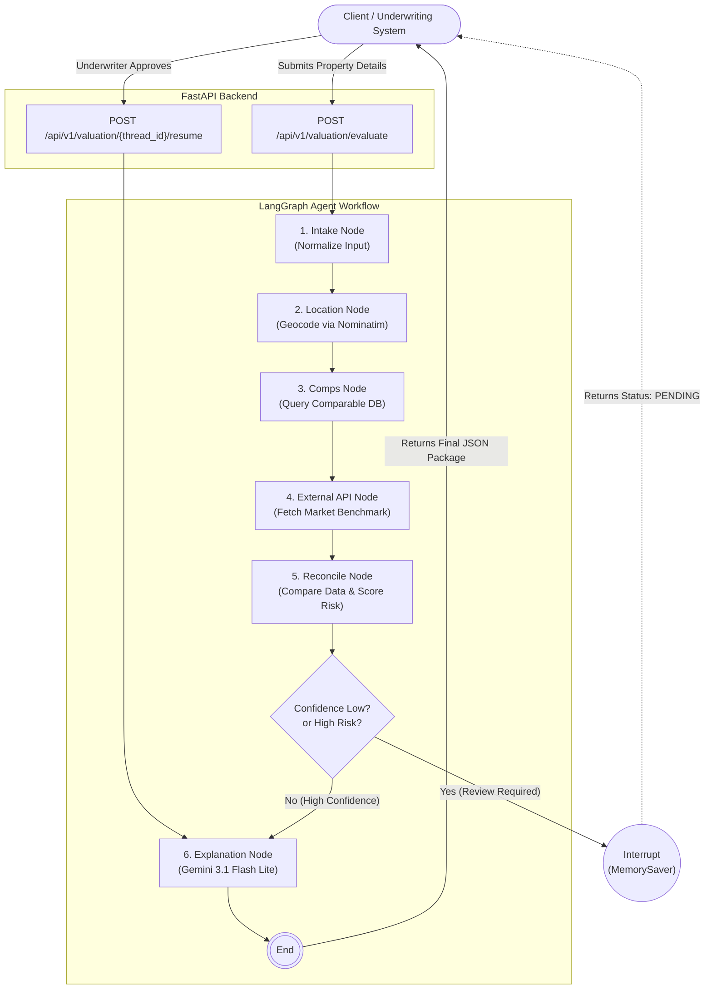

# Property Valuation Agent — India

This repository contains an **Agentic AI Mortgage Underwriting System** specifically designed for Residential Property Valuation in India. It is a decision-support component built with **FastAPI** and **LangGraph**, relying on a hybrid valuation approach (Comparable Sales + Market APIs) rather than an LLM alone.

## Architecture Highlights



- **LangGraph Orchestration**: Stateful workflow that handles Intake -> Geocoding -> Comps Retrieval -> Market API -> Reconciliation -> Explanation.
- **Dual-Engine Valuation**: Reconciles an internal comparable sales database against an external market valuation benchmark.
- **Human-in-the-Loop (HITL)**: Asynchronous REST endpoints allow the workflow to pause execution when confidence is low, requiring an underwriter to review and approve the valuation before generating the final report.
- **Auditable Explanations**: Uses Google's Gemini LLM (`gemini-3.1-flash-lite`) to generate natural language justifications for the mathematical outputs.

## Setup & Installation

### 1. Requirements
Ensure you have Python 3.10+ installed.

### 2. Environment Setup
```bash
# Clone the repository and cd into the directory
cd property-valuation-agent

# Create a virtual environment
python3 -m venv venv
source venv/bin/activate

# Install dependencies
pip install -r requirements.txt
```

### 3. Environment Variables
To enable the LLM explanation generator, create a `.env` file in the root directory:
```text
GEMINI_API_KEY="your_google_api_key_here"
```
*(If no API key is provided, the system will safely fallback to a mock explanation string).*

## Running the API

Start the FastAPI server using Uvicorn:
```bash
uvicorn app.main:app --reload
```

Once running, navigate to the interactive API documentation:
**[http://localhost:8000/docs](http://localhost:8000/docs)**

## Testing the Flow (Mock Data)

The repository comes pre-loaded with a `dummy_properties.csv` database containing mock properties in Bangalore and Mumbai, as well as a simulated external valuation API. 

**It is 100% ready to test out of the box.**

You can run the automated integration test to see the LangGraph pause and resume mechanism in action:
```bash
python test_api.py
```

### API Endpoints
- `POST /api/v1/valuation/evaluate`: Triggers the valuation agent. Returns either a finished valuation or a `PENDING_HUMAN_REVIEW` status.
- `POST /api/v1/valuation/{thread_id}/resume`: Allows an underwriter to approve or reject a paused valuation.

## Future Enhancements
- Swap the mock `dummy_properties.csv` with a Vector Database (e.g., ChromaDB/FAISS).
- Swap the mock external API (`app/tools/external_api.py`) with a live integration (e.g., Zapkey, Propstack) or a live web scraper.
